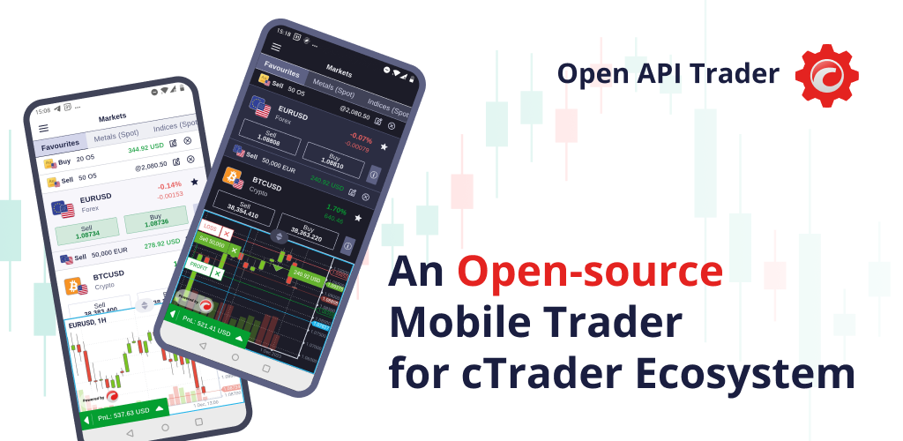

# Open API Trader

Open API Trader is a mobile trading application for the cTrader ecosystem.

It can be used with any account of 200+ brokers that have chosen cTrader — the no. 1 trading platform in the world for FX/CFD trading.

The app was coded with Flutter, which is a rising power of mobile application development and is therefore available for both Android and iOS platforms. The code is available for modification according to your business needs, whether you are an affiliate or a broker who wishes to create a custom trading terminal for your end users.

Please check the application's documentation in the attached “Open API Trader” PDF file.

[Table with execution events](https://docs.google.com/spreadsheets/d/1irIPGzVOIUUyM8BzhCj57sDoyneq0e5xAOtK785eXw4/edit#gid=0) (part of the app’s documentation)

[Application design in Figma](https://www.figma.com/community/file/1313907466391188768/open-api-trader)

[Customisable symbol icons in Figma](https://www.figma.com/community/file/1313888860375039237/symbols-icons-for-trading-application-or-website)

For any questions or requests regarding modifications, do not hesitate to contact us [via Telegram](https://t.me/ctrader_open_api_support).

